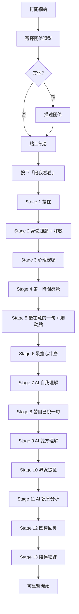

# Boundary Coach — 產品規格與架構

## 1. 產品定位

這不是回信工具。這是一位溫暖、穩定、安全的陪伴者。

用最溫柔的語氣，守護最堅定的您。

當使用者受到訊息影響時，協助：

1. 傾聽自己  
2. 理解自己  
3. 照顧自己  
4. 建立界線  
5. **最後**才決定如何回應  

核心信念：人被理解之後才有能力思考；人被接住之後才有能力成長。

---

## 2. 完整頁面架構

```
/
├── 首頁（Home）
│   ├── Brand Hero：Boundary Coach
│   ├── 副標：不是教你如何回覆別人。而是陪你先聽見自己。
│   ├── 品牌句：用最溫柔的語氣，守護最堅定的您。
│   └── 進入表單
│       ├── 關係類型（含「其他」自由描述）
│       ├── 這段訊息來自誰？
│       ├── 你想怎麼稱呼對方？（稱謂）
│       ├── 發生了什麼事？（訊息貼上）
│       └── CTA：「陪我看看」
│
└── 陪伴旅程（Journey）— 同一頁狀態切換，共 14 階段
    ├── Stage 1  接住使用者
    ├── Stage 2  生理照顧 + 呼吸引導
    ├── Stage 3  心理安頓
    ├── Stage 4  情緒陪伴
    ├── Stage 5  情緒覺察（串流）
    ├── Stage 6  情緒來源探索
    ├── Stage 7  自我理解（串流）
    ├── Stage 8  自我辯證
    ├── Stage 9  雙方理解（AI）
    ├── Stage 10 界線建立
    ├── Stage 11 訊息分析（AI）← 此時才分析
    ├── Stage 12 回應風格 + 稱謂
    ├── Stage 13 正式回覆（串流）← 先理解感謝，再表達
    └── Stage 14 陪伴總結
```

技術對應：

| 層級 | 路徑 |
|------|------|
| 頁面 | `src/app/page.tsx` |
| 主狀態機 | `src/components/coach/CoachApp.tsx` |
| 階段 UI | `src/components/coach/stages/*` |
| API | `POST /api/coach` |
| Prompt | `src/lib/prompts/*` |
| OpenAI | `src/lib/openai.ts` |
| 型別 | `src/types/coach.ts` |

---

## 3. 使用者流程圖



**關鍵約束：** Stage 1–8 禁止分析訊息、禁止給回覆建議。分析與回覆僅出現在 Stage 11–12。

---

## 4. Wireframe（文字稿）

### 4.1 首頁

```
┌─────────────────────────────────────────────┐
│           （柔和米白 + 淡藍綠氛圍）            │
│                                             │
│           Boundary Coach                    │
│     不是教你如何回覆別人。                    │
│     而是陪你先聽見自己。                      │
│     用最溫柔的語氣，守護最堅定的您。            │
│                                             │
│  關係類型                                   │
│  [父母][伴侶][前任][親戚][朋友]…[其他]        │
│  （若其他）[請描述你們的關係____________]     │
│                                             │
│  這段訊息來自誰？                            │
│  [________________________________]         │
│                                             │
│  你想怎麼稱呼對方？                          │
│  [________________________________]         │
│                                             │
│  發生了什麼事？                              │
│  ┌─────────────────────────────────────┐   │
│  │ 把讓你不舒服的訊息貼在這裡。          │   │
│  │ 不需要整理。不需要修飾。…            │   │
│  └─────────────────────────────────────┘   │
│                                             │
│              [ 陪我看看 ]                    │
└─────────────────────────────────────────────┘
```

### 4.2 旅程頁（通用骨架）

```
┌─────────────────────────────────────────────┐
│  Boundary Coach             ○○○○○······     │
│  階段標題：照顧身體                          │
│                                             │
│  ┌─ 陪伴訊息 ───────────────────────────┐   │
│  │ 溫暖、短句、有呼吸感的文字             │   │
│  └──────────────────────────────────────┘   │
│                                             │
│  （選項 / 輸入 / 呼吸引導 / AI 結果）         │
│                                             │
│              [ 慢慢繼續 ]                    │
└─────────────────────────────────────────────┘
```

### 4.3 Stage 2 身體照顧

```
標題：你的身體還好嗎？
□ 呼吸有點急  □ 胸口悶悶的  □ 肩膀很緊 …
照顧建議：先喝幾口水。慢慢來。…
呼吸引導：[吸 4] → [停 4] → [吐 6] × 3
```

### 4.4 Stage 12 回覆建議

```
溫和版 | 理性版 | 界線版 | 極簡版
（分頁或並排卡片，可複製）
```

---

## 5. 元件拆分

```
components/coach/
├── CoachApp.tsx              # 總狀態機：home ↔ stages
├── HomeForm.tsx              # 首頁表單
├── JourneyShell.tsx          # 旅程外殼（進度、標題）
├── CompanionBubble.tsx       # AI/系統陪伴文字
├── SoftButton.tsx            # 主 CTA
├── OptionChip.tsx            # 單選/多選選項
├── ProgressDots.tsx          # 階段進度
├── BreathGuide.tsx           # 呼吸引導動畫
├── CopyBlock.tsx             # 可複製回覆區塊
├── hooks/
│   └── useCoachAi.ts         # 呼叫 /api/coach
└── stages/
    ├── StageCatch.tsx
    ├── StageBodyCare.tsx
    ├── StageSettling.tsx
    ├── StageEmotionCompanion.tsx
    ├── StageEmotionAwareness.tsx
    ├── StageEmotionSource.tsx
    ├── StageSelfUnderstanding.tsx
    ├── StageSelfAdvocacy.tsx
    ├── StageMutualUnderstanding.tsx
    ├── StageBoundary.tsx
    ├── StageMessageAnalysis.tsx
    ├── StageReplySuggestions.tsx
    └── StageClosing.tsx
```

---

## 6. Prompt System

| 層級 | 檔案 | 職責 |
|------|------|------|
| System | `lib/prompts/system.ts` | 角色、信念、禁止事項、語氣 |
| Task | 同檔各 `*_PROMPT` | 各 AI action 的任務與 JSON schema |
| Context builder | `lib/prompts/builders.ts` | 組裝 session 脈絡；前期標註「請勿分析」 |
| Runtime | `lib/openai.ts` | `runCoachAi(action, session)` |

### AI Actions（僅這些會打 OpenAI）

| Action | 對應 Stage | 時機 |
|--------|------------|------|
| `emotion_followup` | 5 | 使用者選出最在意的一句後（串流） |
| `self_understanding` | 7 | 自我理解整理（串流） |
| `mutual_understanding` | 9 | 雙方需求（不評判） |
| `message_analysis` | 11 | **此時才分析訊息** |
| `formal_reply` | 13 | **選定風格與稱謂後，產出正式回覆（串流）** |

Stage 12 僅選擇風格與稱謂，不呼叫模型。
Stage 1–4、6、8、10、14 使用靜態溫暖文案。

正式回覆結構：稱謂 → 真誠理解 → 感謝 → 依風格表達自己。

串流端點：`POST /api/coach/stream`（純文字 chunk）。
結構化 JSON 仍走：`POST /api/coach`。

---

## 7. TypeScript 型別

核心定義見 `src/types/coach.ts`：

- `RelationshipType` / `BodySensation` / `FirstFeeling` / `TouchPoint`
- `CoachStageId` (1–13) / `CoachStageKey`
- `CoachSession`：輸入 + 各階段回應
- `CoachAiAction` / `CoachAiRequest` / `CoachAiResponse`
- 各 action 的 result 型別（`SelfUnderstandingResult` 等）

---

## 8. OpenAI 整合架構

```
Browser (CoachApp)
    │  POST /api/coach  { action, session, userInput? }
    ▼
Route Handler (api/coach/route.ts)
    │  驗證 action / session / 長度
    ▼
runCoachAi (lib/openai.ts)
    │  system = COACH_SYSTEM_PROMPT + task prompt
    │  user   = buildActionUserPrompt(...)
    │  response_format = json_object
    ▼
OpenAI Chat Completions
    │
    ▼
parseAiData → typed CoachAiData → JSON response
```

環境變數：

- `OPENAI_API_KEY`（必填）
- `OPENAI_MODEL`（選填，預設 `gpt-4o-mini`）

---

## 9. MVP 範圍

**有：** 完整 13 階段陪伴流程、靜態安頓內容、必要 AI 階段、四種回覆、溫暖 UI。

**暫無：** 登入、歷史紀錄、多語系、串流輸出、危機熱線深度分流（僅 footer 免責）。
